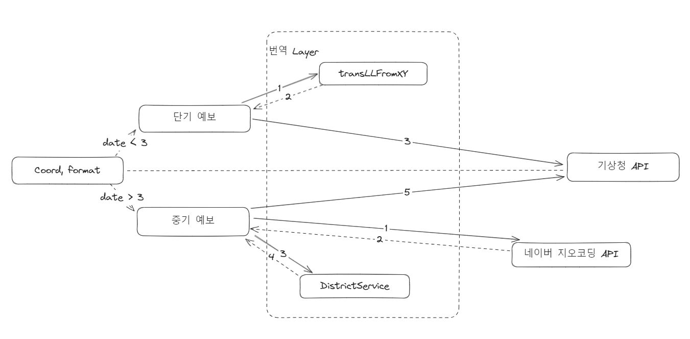

## Overview

--- 
> 기상청 API 사용시 좌표 값으로 기상청 API(단기,중기육상,중기 기온)의 명세에 맞는 `request`를 보내기 위한 프로젝트

* 기상청 API 예시

| 지역 | 단기         | 중기 육상    | 중기 기온    |
|----|------------|----------|----------|
| 서울 | 기상청 고유 격자계 | 11B00000 | 11B10101 |

중기 육상 및 중기 기온 API에 사용되는 코드는 기상청에서 `.xlsx`(Excel) 파일로 공개함.

### Require

---
* Naver API(https://api.ncloud-docs.com/docs/ai-naver-mapsreversegeocoding
  * client_id, secret_key 
* 기상청 API serviceKey [공공데이터포털 검색=기상청](https://www.data.go.kr/tcs/dss/selectDataSetList.do?dType=TOTAL&keyword=%EA%B8%B0%EC%83%81%EC%B2%AD&operator=AND&detailKeyword=&publicDataPk=&recmSe=&detailText=&relatedKeyword=&commaNotInData=&commaAndData=&commaOrData=&must_not=&tabId=&dataSetCoreTf=&coreDataNm=&sort=&relRadio=&orgFullName=&orgFilter=&org=&orgSearch=&currentPage=1&perPage=10&brm=&instt=&svcType=&kwrdArray=&extsn=&coreDataNmArray=&pblonsipScopeCode=)
  * 단기예보
  * 중기예보 (육상, 기온)
* 기상청 예보코드 엑셀파일 or 데이터베이스(직접 구현함)
  * 중기 기온 예보코드
  * 중기 육상 예보코드

### 실행 흐름

---
